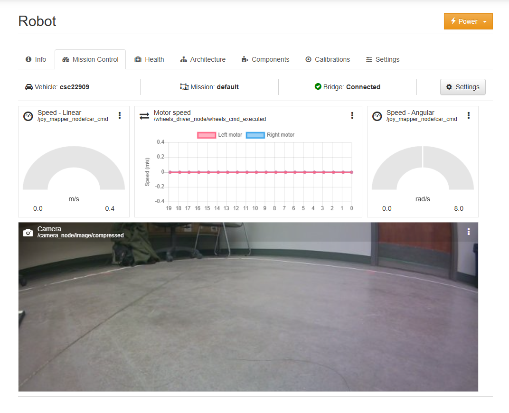
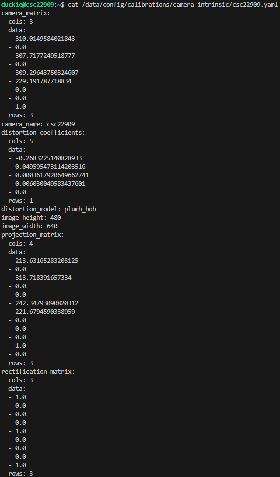
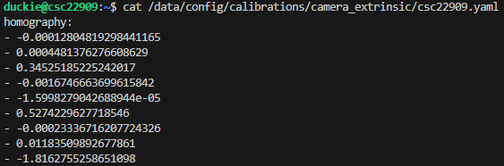
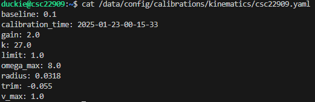

# Exercise 1 Report

### Dashboard camera and motor signals

Below shows an image and a video of the dashboard showing camera and motor signals of our duckiebot. We see that the camera and motors seem to respond to our inputs. The next step is to calibrate them. The purpose of calibrating camera and motors is to account for manufacturing inconsistencies. Just because there is inaccurate output when controlling the duckiebot doesn't mean that it is unusable. We can fix the inconsistencies through manual calibration to some extent. 

#### Dashboard Screenshot

#### Dashboard Video

### Calibrating the Camera
Calibrating the camera makes sure that the robot receive accurate representation of its environment. The duckiebot's camera calibration is simplified and only needed us to move the robot's position and camera angles with respect to an image designed for calibrating it. After calibrating the camera, the robot generated the following files.

#### camera intrinsic yaml

#### camera extrinsic yaml

### Calibrating the Wheels

We calibrated our duckiebot's wheels by repeatedly setting different values to its gain and trim parameters in the terminal. Below shows the contents of our kinematics .yaml file showing these parameters and their calibrated values.

### Driving in a Straight Line

After calibrating the wheels, we achieved a close enough result in making the robot drive in a straight line for 2 meters while only holding down the forward key. It was especially hard to figure out how to correctly set the parameters to keep the duckiebot dead center. After discussing with the TAs, we realized it might be because of the uneven platform beneath the robot. One way to fix this is to increase the gain parameter increasing the average speed of the robot.

### Lane Following

The duckiebot provides an easy to setup lane following demo. We only needed to place the duckiebot on the right side of a particularly designed lane and after some commands in the terminal, we pressed "a" to start the demo. We initially had a hiccup in this part since when we started the demo it moved only a few centimeters before stopping completely. After increasing the gain from 1.0 to 2.0, we are able to achieve a pretty good result.

### Running a python program in the robot

One main and very useful features of docker is for quick and easy recreation of environments that our programs are built and expected to work on. After finishing writing the program for the duckiebot, we used two docker commands to build our program and run it on the robot itself. It is a simple python program that prints "Hello from csc22909!"

### References

[Duckietown Documentation](https://docs.duckietown.com/daffy/opmanual-duckiebot/setup/setup_laptop/index.html)

Project Partner: Abdullah Khadeli at akhadeli@ualberta.ca